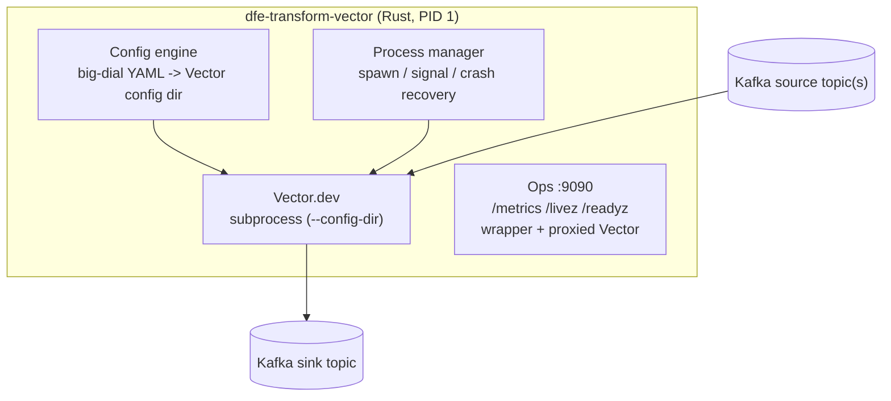

# dfe-transform-vector

[](https://github.com/hyperi-io/dfe-transform-vector/actions)
[](https://github.com/hyperi-io/dfe-transform-vector/blob/main/LICENSE)

> Vector.dev does the transform; everything around it -- config, credentials,
> health, metrics, restarts -- is what a pipeline actually needs in production.
> This wrapper supplies that half and keeps Vector as a subprocess.

Rust wrapper that manages Vector.dev as a subprocess for Kafka-to-Kafka
transform pipelines in the HyperI DFE (Data Fusion Engine) platform. The wrapper
is built on the [scalo](https://github.com/hyperi-io/scalo-rs) data-plane runtime
(config cascade, logging, metrics, health probes, CLI, deployment contract).

## Architecture



## Features

- **Big-dial config**: Simple YAML (pipeline name, brokers, topics, SASL/TLS)
  generates full Vector-native source, sink, and observability YAML
- **DAG auto-wiring**: User-supplied transform YAMLs are loaded, validated, and
  wired between `dfe_source` and `dfe_sink` automatically
- **Crash recovery**: Exponential backoff restarts (1s-60s), K8s-aware readiness
- **Hot-reload**: Poll-based file watcher detects transform changes, validates,
  then SIGHUPs Vector (source/sink changes require pod restart)
- **Version pinning**: Config-level Vector version check (strict/warn/disabled)
- **Production Kafka tuning**: librdkafka defaults baked in with 4-layer cascade
- **Metrics**: Wrapper metrics + proxied Vector internal metrics on single endpoint
- **Helm chart**: Generated Deployment-based chart with KEDA, HPA, ConfigMap

## Quick Start

```bash
# Build
cargo build --release

# Run with config file
./target/release/dfe-transform-vector run --config config.example.yaml

# Generate deployment artifacts
./target/release/dfe-transform-vector emit-dockerfile
./target/release/dfe-transform-vector emit-chart
./target/release/dfe-transform-vector emit-compose
```

## Configuration

See [config.example.yaml](config.example.yaml) for a full annotated configuration.

Key environment variable overrides (prefix `DFE_TRANSFORM_`):

| Variable | Description |
|----------|-------------|
| `DFE_TRANSFORM_SOURCE__BROKERS` | Kafka source broker addresses |
| `DFE_TRANSFORM_SOURCE__TOPICS` | Source topic list |
| `DFE_TRANSFORM_SOURCE__GROUP_ID` | Consumer group ID |
| `DFE_TRANSFORM_SINK__BROKERS` | Kafka sink broker addresses |
| `DFE_TRANSFORM_SINK__TOPIC` | Sink output topic |
| `DFE_TRANSFORM_PIPELINE__NAME` | Pipeline name |
| `DFE_TRANSFORM_TRANSFORMS__DIR` | Transform YAML directory |
| `DFE_TRANSFORM_LOGGING__LEVEL` | Log level (trace/debug/info/warn/error) |

## Hot-Reload

**Hot-reloaded (takes effect via SIGHUP to Vector):**
- Transform YAML file contents (modified/added/removed in watched directory)
- `transforms.dir` / `transforms.files` path changes

**Requires pod restart:**
- `source.*` -- Kafka consumer config baked into Vector at startup
- `sink.*` -- Kafka producer config baked into Vector at startup
- `pipeline.name` -- consumer group_id and metrics labels set at startup
- `vector.*` -- binary path, data_dir, API address set at spawn
- `metrics.*` -- the ops HTTP server is bound at startup
- `logging.*` -- tracing subscriber configured at startup

## Endpoints

One port carries the whole ops surface, so there is a single answer to "is this
pod ready".

| Endpoint | Port | Purpose |
|----------|------|---------|
| `GET /livez` | 9090 | K8s liveness and startup probes (the supervisor is up) |
| `GET /readyz` | 9090 | K8s readiness probe (200 only while the Vector subprocess is up -- see below) |
| `GET /metrics` | 9090 | Prometheus scrape (wrapper + proxied Vector metrics) |

`/readyz` reports whether the Vector subprocess EXISTS, not whether it is
carrying traffic. The gate is that the child was still alive 500ms after spawn,
which rules out the crash-on-start cases (bad argv, unreadable config) and a
pod sitting in crash-recovery backoff. Vector's own startup routinely takes
longer than that, so there is a window where the pod reports ready and Vector
is still coming up. Proving traffic would mean reading Vector's own API, which
the wrapper does not do today.

## Development

```bash
# Run checks (fmt + clippy + test + deny)
make check

# Run tests
cargo nextest run

# Run the e2e suite, opt-in cases included (needs Docker + a Vector binary)
cargo nextest run --test e2e --run-ignored all

# Run the Vector validate cases (needs a Vector binary)
cargo nextest run -E 'test(vector_validate)' --run-ignored all
```

The WS21 acceptance case (`e2e::filebeat_kafka`) runs by default -- it starts
its own broker container. It grades the filebeat corpus against elastic's
golden events, and both live in dfe-transform-vrl, so it skips with a message
unless that repo is checked out beside this one or `DFE_TRANSFORM_VRL_DIR`
points at it.

## Documentation

- [docs/DESIGN.md](https://github.com/hyperi-io/dfe-transform-vector/blob/main/docs/DESIGN.md) -- Full architecture and design
- [docs/MIGRATION.md](https://github.com/hyperi-io/dfe-transform-vector/blob/main/docs/MIGRATION.md) -- Migration from official Vector chart
- [docs/LIBRDKAFKA.md](https://github.com/hyperi-io/dfe-transform-vector/blob/main/docs/LIBRDKAFKA.md) -- Kafka tuning reference
- [RESEARCH.md](https://github.com/hyperi-io/dfe-transform-vector/blob/main/RESEARCH.md) -- Research findings and option analysis

## License

This project is licensed under the Business Source License 1.1
(BUSL-1.1). See [LICENSE](https://github.com/hyperi-io/dfe-transform-vector/blob/main/LICENSE) for details.

Copyright (c) 2026 HYPERI PTY LIMITED

For commercial licensing options, see [COMMERCIAL.md](https://github.com/hyperi-io/dfe-transform-vector/blob/main/COMMERCIAL.md).
