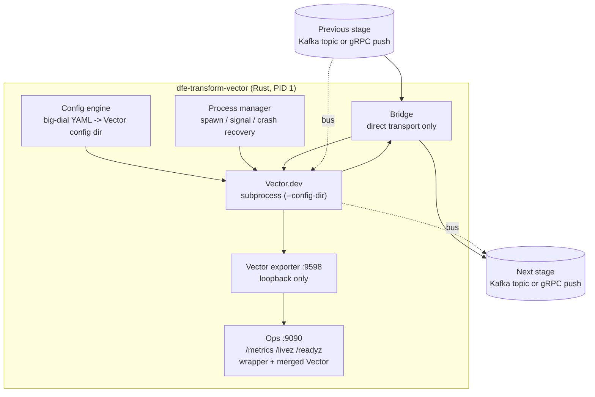

# dfe-transform-vector

[](https://github.com/hyperi-io/dfe-transform-vector/actions)
[](https://github.com/hyperi-io/dfe-transform-vector/blob/main/LICENSE)

> Vector.dev does the transform; everything around it -- config, credentials,
> health, metrics, restarts -- is what a pipeline actually needs in production.
> This wrapper supplies that half and keeps Vector as a subprocess.

Rust wrapper that manages Vector.dev as a subprocess, so a Vector pipeline is a
transform stage in the HyperI DFE (Data Fusion Engine) platform. The wrapper is
built on the [scalo](https://github.com/hyperi-io/scalo-rs) data-plane runtime
(config cascade, logging, metrics, health probes, CLI, deployment contract).

## Architecture



## Two transports, one template each

One deployment runs one transport, and the transform you author is identical on
both. What changes is who hands the record over.

| | `bus` | `direct` |
|---|---|---|
| In | Kafka `<source>_land` | a scalo Push listener on `source.listen` |
| Out | Kafka `<source>_load` | a scalo Push client to `sink.endpoint` |
| Needs a broker | yes | no |
| Vector sees | `kafka` source and sink | `vector` source and sink on loopback |

`templates/bus.yaml` and `templates/direct.yaml` are the whole Vector topology
for each, commented per field and runnable as they stand -- copy one, replace
the `dfe_transform` step, and you have a working pipeline. In a DFE deployment
the supervisor generates the `sources:` and `sinks:` blocks from the big dials
and you author only the `transforms:` block, so do not mount a whole template as
a transform file: Vector would then run two sources and two sinks.

On `direct` Vector does not speak scalo's `Transport/Push`, so the supervisor
translates. It accepts records on `source.listen`, hands them to Vector over
`bridge.to_vector`, takes them back on `bridge.from_vector`, and pushes them to
`sink.endpoint`. Both inner legs are loopback -- they exist inside one pod.
A push is answered only once the next hop has its records. A hop that cannot
move on is retried until the push's hold runs out, 18 s at `source.listen` and
16.5 s at `bridge.from_vector`, each send to the next stage giving up after
15 s, and then the push is answered `Unavailable` so its sender retries. The one
record that is dropped, and counted, is one over the next stage's message-size
ceiling, which no retry would get through. Under memory pressure only
`source.listen` sheds pushes; the leg back from Vector keeps draining.

## Features

- **Big-dial config**: Simple YAML (pipeline name, brokers, topics, SASL/TLS)
  generates full Vector-native source, sink, and observability YAML
- **DAG auto-wiring**: User-supplied transform YAMLs are loaded, validated, and
  wired between `dfe_source` and `dfe_sink` automatically
- **Crash recovery**: Exponential backoff restarts (1s-60s), K8s-aware readiness
- **Hot-reload**: Poll-based file watcher detects transform changes, validates,
  then SIGHUPs Vector (source/sink changes require pod restart)
- **Version pinning**: Config-level Vector version check (strict/warn/disabled)
- **Production Kafka tuning**: librdkafka defaults baked in with 4-layer cascade
- **Metrics**: Vector's own `vector_*` merged into the wrapper's registry, so one
  endpoint and one OTLP push carry both
- **Helm chart**: Generated Deployment-based chart with KEDA, HPA, ConfigMap

## Quick Start

```bash
# Build
cargo build --release

# Run with config file
./target/release/dfe-transform-vector run --config config.example.yaml

# Generate deployment artefacts
./target/release/dfe-transform-vector emit-dockerfile
./target/release/dfe-transform-vector emit-compose

# emit-chart overwrites whatever directory you point it at. The committed
# chart/ carries KEDA hand-edits the generator does not produce, so render
# somewhere scratch and diff rather than regenerating over it.
./target/release/dfe-transform-vector emit-chart /tmp/dfe-transform-vector-chart
```

## Configuration

See [config.example.yaml](https://github.com/hyperi-io/dfe-transform-vector/blob/main/config.example.yaml)
for a full annotated configuration.

Key environment variable overrides (prefix `DFE_TRANSFORM_`):

| Variable | Description |
|----------|-------------|
| `DFE_TRANSFORM_SOURCE_TRANSPORT` | `bus` or `direct` |
| `DFE_TRANSFORM_SOURCE_LISTEN` | Push listener bind address (direct) |
| `DFE_TRANSFORM_SOURCE__BROKERS` | Kafka source broker addresses |
| `DFE_TRANSFORM_SOURCE__TOPICS` | Source topic list |
| `DFE_TRANSFORM_SOURCE__GROUP_ID` | Consumer group ID |
| `DFE_TRANSFORM_SINK_TRANSPORT` | `bus` or `direct` |
| `DFE_TRANSFORM_SINK_ENDPOINT` | Next stage's Push listener (direct) |
| `DFE_TRANSFORM_SINK__BROKERS` | Kafka sink broker addresses |
| `DFE_TRANSFORM_SINK__TOPIC` | Sink output topic, and the routing key on direct |
| `DFE_TRANSFORM_BRIDGE_TO_VECTOR` | Where Vector accepts records (direct, loopback) |
| `DFE_TRANSFORM_BRIDGE_FROM_VECTOR` | Where the supervisor accepts them back (direct, loopback) |
| `DFE_TRANSFORM_PIPELINE__NAME` | Pipeline name |
| `DFE_TRANSFORM_TRANSFORMS__DIR` | Transform YAML directory |
| `DFE_TRANSFORM_LOGGING__LEVEL` | Log level (trace/debug/info/warn/error) |

### Hot-reload

**Hot-reloaded (takes effect via SIGHUP to Vector):**
- Transform YAML file contents (modified/added/removed in watched directory)
- `transforms.dir` / `transforms.files` path changes

**Requires pod restart:**
- `source.*` -- the consumer or the Push listener is established at startup
- `sink.*` -- the producer or the Push client is established at startup
- `bridge.*` -- the two supervisor-to-Vector legs bind at startup
- `pipeline.name` -- consumer group_id and metrics labels set at startup
- `vector.*` -- binary path, data_dir, API address set at spawn
- `metrics.*` -- the ops HTTP server is bound at startup
- `logging.*` -- tracing subscriber configured at startup

## Endpoints

One port carries the whole ops surface, so there is a single answer to "is this
pod ready".

| Endpoint | Port | Purpose |
|----------|------|---------|
| `GET /livez` | 9090 | K8s liveness and startup probes (the supervisor is up) |
| `GET /readyz` | 9090 | K8s readiness probe (200 only while the Vector subprocess is up and its sink is delivering -- see below) |
| `GET /metrics` | 9090 | Prometheus scrape (wrapper + merged Vector metrics) |
| `GET /metrics` | 9598 | Vector's own exporter, loopback only, for debugging |
| `Transport/Push` | 6000 | Records in, on the direct transport only |

## Metrics

9090 carries everything. The wrapper GETs Vector's `prometheus_exporter` on
`metrics.vector_metrics_address` (default `127.0.0.1:9598`) at scalo's metrics
interval, parses the exposition, and registers every sample on the same
registry scalo serves and pushes over OTLP. `vector_*` names and labels are
preserved, with the platform namespace and labels scalo applies to every other
metric.

9598 is a loopback debug surface, not a scrape target. Nothing outside the pod
needs it: no second Prometheus target, no PodMonitor selector, no published
container port. Change the port with
`DFE_TRANSFORM_METRICS__VECTOR_METRICS_ADDRESS` (or `metrics.vector_metrics_address`
in the config file) and both the Vector sink and the wrapper's scrape follow it.

The merge also feeds the app's own throughput counters, which otherwise read 0
because Vector, not the wrapper, owns the Kafka client:

| Wrapper metric | Vector source |
|----------------|---------------|
| `records_received_total` | `vector_component_received_events_total{component_id="dfe_source"}` |
| `records_processed_total`, `records_delivered_total` | `vector_component_sent_events_total{component_id="dfe_sink"}` |
| `records_error_total` | `vector_component_discarded_events_total` on `dfe_sink` (records it rejected) and on `dfe_size_cap` (records over the producer's `message.max.bytes`) |
| `transform_vector_sink_errors_total` | `vector_component_errors_total{component_id="dfe_sink"}` |

An unreachable exporter is not fatal: the scrape warns at most once every five
minutes, counts `transform_vector_scrape_failures_total`, and leaves readiness
alone. So is an oversized one -- a response past 4 MiB is a failed scrape, not
a partial merge.

A component Vector drops stops appearing in the exposition. Its gauges are
zeroed after `metrics.vector_metrics_expiry_ticks` scrapes without it (default
4), rather than reading their last value until the pod restarts. Its counters
are left flat, which already rates to zero.

`/readyz` reports two things. First, whether the Vector subprocess EXISTS: the
child was still alive 500ms after spawn, which rules out the crash-on-start
cases (bad argv, unreadable config) and a pod sitting in crash-recovery
backoff. Vector's own startup routinely takes longer than that, so there is a
window where the pod reports ready and Vector is still coming up.

Second, whether the sink is delivering. The sink never gives up on a record
(`sink.message_timeout_ms: 0`), so a partition with no leader would otherwise
hold records indefinitely under a live, Ready process. When the sink holds
records and has delivered or dropped none of them for `metrics.sink_stall_secs`
(default 60), `/readyz` answers 503 until it moves again. An idle sink is never
stalled.

## Development

```bash
# Run checks (fmt + clippy + test + deny)
make check

# Run tests
cargo nextest run

# Run the e2e suite, opt-in cases included (needs Docker + a Vector binary)
cargo nextest run --test e2e --run-ignored all

# Run the Vector validate cases (needs a Vector binary)
cargo nextest run -E 'test(vector_validate)' --run-ignored all

# Drive the release build's PGO workload by hand (needs no broker or Vector)
PGO_WORKLOAD_DURATION_SECS=60 scripts/pgo-workload.sh target/debug/dfe-transform-vector
```

Release builds are PGO- and BOLT-optimised, off `scripts/pgo-workload.sh`: it
drives the direct transport, the subprocess watch and the Vector metrics merge
for five minutes on each arch. That covers the supervisor binary and nothing
else -- Vector's own per-record work happens in the binary the image downloads,
which this repo does not compile.

The filebeat acceptance case (`e2e::filebeat_kafka`) runs by default -- it starts
its own broker container. It grades the filebeat corpus against elastic's
golden events, and both live in dfe-transform-vrl, so it skips with a message
unless that repo is checked out beside this one or `DFE_TRANSFORM_VRL_DIR`
points at it.

## Documentation

- [docs/architecture.md](https://github.com/hyperi-io/dfe-transform-vector/blob/main/docs/architecture.md) -- The problem, the ownership boundary and the invariants
- [docs/DESIGN.md](https://github.com/hyperi-io/dfe-transform-vector/blob/main/docs/DESIGN.md) -- Full architecture and design
- [docs/MIGRATION.md](https://github.com/hyperi-io/dfe-transform-vector/blob/main/docs/MIGRATION.md) -- Migration from official Vector chart
- [docs/LIBRDKAFKA.md](https://github.com/hyperi-io/dfe-transform-vector/blob/main/docs/LIBRDKAFKA.md) -- Kafka tuning reference
- [RESEARCH.md](https://github.com/hyperi-io/dfe-transform-vector/blob/main/RESEARCH.md) -- Research findings and option analysis

## License

This project is licensed under the Business Source License 1.1
(BUSL-1.1). See [LICENSE](https://github.com/hyperi-io/dfe-transform-vector/blob/main/LICENSE) for details.

Copyright (c) 2026 HYPERI PTY LIMITED

For commercial licensing options, see [COMMERCIAL.md](https://github.com/hyperi-io/dfe-transform-vector/blob/main/COMMERCIAL.md).

## Context

### What this is

A Rust supervisor that runs Vector.dev as a child process so a Vector pipeline
behaves like every other DFE app -- one big-dial config, one ops port, an OTLP
push, a consumer-lag scaling signal and a chart dfe-engine compiles. It is NOT
the transform engine and it does not build Vector: the image downloads the
upstream release binary at the version pinned by `VECTOR_VERSION` in
`src/deployment.rs`, and cargo compiles only the supervisor. It is also not a
singleton and not part of the default deploy -- `dfe-infra/apps.yaml` declares
it `multiplicity: per_config` with `scale_deployed: true` and an empty
`default_in`, so one deployment exists per source config and only when a
deployment asks for it.

### Where things live

| Path | What it holds |
|---|---|
| `src/main.rs` | CLI entry. Fills scalo's `CommonArgs` from the loaded config before `run_app`, which is what makes `metrics.address` and `logging.*` take effect |
| `src/config/` | `loader` -> `validate` -> `generate` -> `wiring` -> `assembler`, plus `reload`, `transforms` and `kafka_defaults` |
| `src/vector/` | `process` spawn and backoff, `lifecycle` states, and `binary` -- version selection kept pure and NOT on the run path, which its own header explains |
| `src/bridge.rs` | The direct-transport translation between scalo `Transport/Push` and Vector `PushEvents`. Does nothing on `bus` |
| `src/health.rs`, `src/metrics.rs`, `src/metrics/scrape.rs` | Readiness publishing, and the scrape that merges `vector_*` into scalo's registry |
| `src/deployment.rs`, `src/vector-layer.dockerfile` | The two-binary image override spliced onto scalo's generated Dockerfile |
| `templates/bus.yaml`, `templates/direct.yaml` | Whole runnable Vector topologies, one per transport, commented per field |
| `pipelines/filebeat/` | The shipped filebeat pipeline |
| `chart/` | The committed Helm chart. Carries KEDA hand-edits, so NOT pure generator output |
| `deploy/` | Argo Application and the helm kustomization overlays |
| `docs/` | `architecture.md` for the shape and the invariants, `DESIGN.md` for field-by-field depth, `MIGRATION.md`, `LIBRDKAFKA.md`, the generated `config-schema.*` and `capability-catalog.*` |
| `tests/` | `integration`, `e2e`, `smoke`, and `TESTING.md` for how the broker and Vector binary are resolved |
| `scripts/fetch-vector.sh`, `scripts/pgo-workload.sh` | Downloads the pinned Vector for tests, and drives the PGO/BOLT workload |

### Commands that prove a change

```bash
make check                                   # hyperi-ci check -- quality + test
cargo nextest run --lib                      # unit only, no infrastructure
cargo nextest run --test integration         # config assembly, wiring, lifecycle, metrics
cargo nextest run --test smoke               # CLI surface
cargo nextest run --test e2e                 # needs Docker or a live broker
cargo nextest run --run-ignored all          # everything, opt-in cases included
```

`cargo nextest run --lib` was run against this branch: 112 passed, 1 skipped.

What green does NOT mean:

- **The default run skips the Vector validator.** Seven `#[ignore]` cases need a
  real Vector binary -- six in `tests/integration/vector_validate.rs` and one in
  `tests/e2e/kafka.rs`. Until you pass `--run-ignored all`, nothing has run
  Vector's own validator over an assembled config.
- **Locally, a missing broker or Vector binary SKIPS rather than fails.** In CI
  that same absence is an assertion failure instead, so CI is stricter than a
  green laptop run.
- **`e2e::filebeat_kafka` runs by default but skips without a sibling repo.** The
  corpus and elastic's golden events live in dfe-transform-vrl, so it needs that
  repo checked out beside this one or `DFE_TRANSFORM_VRL_DIR` pointing at it.
- **A docs-only push runs no CI at all.** `paths-ignore` for `docs/**` and
  `**.md` is on the `push` trigger but not on `pull_request`, so the PR is the
  only place a docs change is checked. A silent push is not a pass.

### What tends to bite

| Don't | Do | Why |
|---|---|---|
| Point `emit-chart` at `chart/` | Render to a scratch directory and diff | `chart/` carries KEDA hand-edits the generator does not produce, including a ScaledObject addressed at `config.source.*` where the generator emits `config.kafka.*`. A test asserts the committed chart matches the generator except for four exempted files |
| Bump the Vector version in one place | Change `VECTOR_VERSION` in `src/deployment.rs` and carry it to `chart/values.yaml` | The chart once said 0.48.0 while the image baked 0.57.0, nine minor versions apart, and only `version_check: warn` kept pods starting. Under `strict` that pairing refuses to start at all |
| Mount a whole `templates/*.yaml` as a transform file | Copy only its `transforms:` block | The supervisor generates `sources:` and `sinks:` from the big dials, so Vector would run two sources and two sinks |
| Change `password` to a `SensitiveString` to look safer | Leave it a `String` | `SensitiveString` serialises as `***REDACTED***` and the figment serialize-merge-deserialize round trip in `apply_figment_env()` destroys the value. Masking happens in logs and `Debug`, and Vector reads the credential from files through its `directory` secret backend, so it never lands in the Vector config |
| Put a `${VAR}` placeholder in a credential or a transform | Mount the secret and set `sasl.secret_dir`, or give the credential through `DFE_TRANSFORM_{SOURCE,SINK}_SASL_*`; read the environment in VRL with `get_env_var` | Vector 0.57+ expands no `${VAR}` without `--dangerously-allow-env-var-interpolation`, which the supervisor never passes, so the placeholder reaches the broker as the password |
| Assume a config key you added is wired because it parses and validates | Prove it changes behaviour, and add it to the standing check that every committed config file loads | `metrics.address` and `logging.level` never left the struct. A config saying `metrics.address: 0.0.0.0:19099` still listened on 9090, so a deployment moving the metrics port lost every probe |
| Set `enable.auto.commit: false` here, as the shared DFE consumer baseline does | Leave auto-commit on | Vector's kafka source only stores offsets and leaves librdkafka's commit timer to flush them, and that timer is armed only when auto-commit is on. Consumer lag sat at 72 across a quiet 90-second window while the app's own metrics said it had processed those same 72 events |
| Read `/readyz` as "carrying traffic" | Read it as "the child was alive 500ms after spawn" | It once answered an unconditional 200 because nothing published a readiness signal, so Vector could crash and restart hundreds of times with the pod still Ready and zero restarts |
| Swap the reload poller for inotify | Keep polling | S3-backed mounts -- s3fs, goofys, Mountpoint for S3 -- generate no filesystem notification events, so inotify works on every laptop and silently stops reloading in production |
| Rename a credential field, or add one whose leaf name is not `password`, `secret`, `token`, `api_key`, `private_key` or `passphrase` | Add the `x-dfe-secret` marker to the schema first | This repo ships no `x-dfe-secret` marker anywhere. The only thing redacting the SASL password over dfe-engine's API is its leaf-name fallback in `appmgmt/contract.py`, so a rename outside that set returns an operator's Kafka password in the clear. The sibling dfe-transform-vrl marked its Kafka passwords already |

### Where this sits

Generated from `dfe-infra/suite.yaml` via
`python3 /projects/dfe-infra/scripts/dfe-stack suite --consumer dfe-transform-vector`
and `--producer dfe-transform-vector`.

Inbound -- what this repo depends on:

- **scalo-rs**, `cargo-dep`. `Cargo.toml` declares the `scalo` crate by range,
  with a second range covering the dev dependency. A scalo release reaches this
  repo, so widen the range if it does not admit the new version, then rebuild.
- **scalo-rs**, `generated-file`, lockstep. The committed `Dockerfile` is written
  by `scalo::deployment::generate_dockerfile()` -- its own header names the
  generator and the schema version -- and this repo splices the Vector layer onto
  it. When the generator or its schema moves, regenerate with
  `dfe-transform-vector emit-dockerfile > Dockerfile` and commit the diff.

Outbound -- what depends on this repo:

- **dfe-infra**, `image-pin`, lockstep. `dfe-infra/helm/charts/dfe-transform-vector/Chart.yaml`
  pins this repo's container image as a tag plus the digest that makes the tag
  immutable. Bump the tag, re-resolve the digest, and `check_versions_drift.py`
  confirms the chart's `appVersion` and the digest mirror agree with the pin.

Two more relationships that are real but are NOT declared edges in the suite
graph, so no gate enforces them:

- **dfe-infra `apps.yaml`** is the SSoT for this app's shape -- multiplicity,
  scaling, transports, endpoints and which compiler derives its routing.
  dfe-engine reads that manifest, so adding or changing the app is a manifest
  edit, never an engine release.
- **dfe-transform-vrl** holds the filebeat corpus, the bundled pipeline and the
  documented divergences that `e2e::filebeat_kafka` grades against. The
  dependency is a test-time repo checkout only, and the case skips without it.
