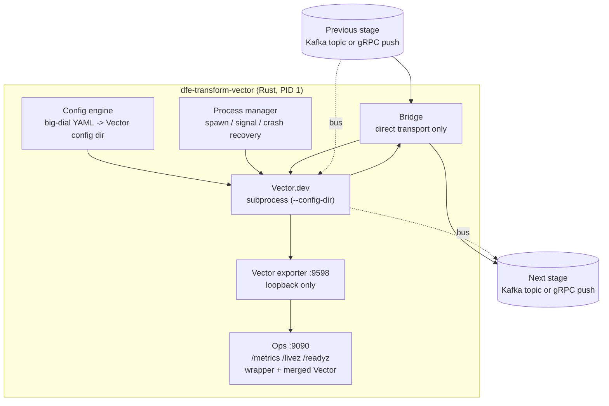

# dfe-transform-vector

[](https://github.com/hyperi-io/dfe-transform-vector/actions)
[](https://github.com/hyperi-io/dfe-transform-vector/blob/main/LICENSE)

> Vector.dev does the transform; everything around it -- config, credentials,
> health, metrics, restarts -- is what a pipeline actually needs in production.
> This wrapper supplies that half and keeps Vector as a subprocess.

Rust wrapper that manages Vector.dev as a subprocess, so a Vector pipeline is a
transform stage in the HyperI DFE (Data Fusion Engine) platform. The wrapper is
built on the [scalo](https://github.com/hyperi-io/scalo-rs) data-plane runtime
(config cascade, logging, metrics, health probes, CLI, deployment contract).

## Architecture



## Two transports, one template each

One deployment runs one transport, and the transform you author is identical on
both. What changes is who hands the record over.

| | `bus` | `direct` |
|---|---|---|
| In | Kafka `<source>_land` | a scalo Push listener on `source.listen` |
| Out | Kafka `<source>_load` | a scalo Push client to `sink.endpoint` |
| Needs a broker | yes | no |
| Vector sees | `kafka` source and sink | `vector` source and sink on loopback |

`templates/bus.yaml` and `templates/direct.yaml` are the whole Vector topology
for each, commented per field and runnable as they stand -- copy one, replace
the `dfe_transform` step, and you have a working pipeline. In a DFE deployment
the supervisor generates the `sources:` and `sinks:` blocks from the big dials
and you author only the `transforms:` block, so do not mount a whole template as
a transform file: Vector would then run two sources and two sinks.

On `direct` Vector does not speak scalo's `Transport/Push`, so the supervisor
translates. It accepts records on `source.listen`, hands them to Vector over
`bridge.to_vector`, takes them back on `bridge.from_vector`, and pushes them to
`sink.endpoint`. Both inner legs are loopback -- they exist inside one pod.
Nothing on that path drops a record: a hop that cannot move on holds and
retries, which stops the listener behind it draining, so the caller upstream is
back-pressured instead.

## Features

- **Big-dial config**: Simple YAML (pipeline name, brokers, topics, SASL/TLS)
  generates full Vector-native source, sink, and observability YAML
- **DAG auto-wiring**: User-supplied transform YAMLs are loaded, validated, and
  wired between `dfe_source` and `dfe_sink` automatically
- **Crash recovery**: Exponential backoff restarts (1s-60s), K8s-aware readiness
- **Hot-reload**: Poll-based file watcher detects transform changes, validates,
  then SIGHUPs Vector (source/sink changes require pod restart)
- **Version pinning**: Config-level Vector version check (strict/warn/disabled)
- **Production Kafka tuning**: librdkafka defaults baked in with 4-layer cascade
- **Metrics**: Vector's own `vector_*` merged into the wrapper's registry, so one
  endpoint and one OTLP push carry both
- **Helm chart**: Generated Deployment-based chart with KEDA, HPA, ConfigMap

## Quick Start

```bash
# Build
cargo build --release

# Run with config file
./target/release/dfe-transform-vector run --config config.example.yaml

# Generate deployment artefacts
./target/release/dfe-transform-vector emit-dockerfile
./target/release/dfe-transform-vector emit-compose

# emit-chart overwrites whatever directory you point it at. The committed
# chart/ carries KEDA hand-edits the generator does not produce, so render
# somewhere scratch and diff rather than regenerating over it.
./target/release/dfe-transform-vector emit-chart /tmp/dfe-transform-vector-chart
```

## Configuration

See [config.example.yaml](https://github.com/hyperi-io/dfe-transform-vector/blob/main/config.example.yaml)
for a full annotated configuration.

Key environment variable overrides (prefix `DFE_TRANSFORM_`):

| Variable | Description |
|----------|-------------|
| `DFE_TRANSFORM_SOURCE_TRANSPORT` | `bus` or `direct` |
| `DFE_TRANSFORM_SOURCE_LISTEN` | Push listener bind address (direct) |
| `DFE_TRANSFORM_SOURCE__BROKERS` | Kafka source broker addresses |
| `DFE_TRANSFORM_SOURCE__TOPICS` | Source topic list |
| `DFE_TRANSFORM_SOURCE__GROUP_ID` | Consumer group ID |
| `DFE_TRANSFORM_SINK_TRANSPORT` | `bus` or `direct` |
| `DFE_TRANSFORM_SINK_ENDPOINT` | Next stage's Push listener (direct) |
| `DFE_TRANSFORM_SINK__BROKERS` | Kafka sink broker addresses |
| `DFE_TRANSFORM_SINK__TOPIC` | Sink output topic, and the routing key on direct |
| `DFE_TRANSFORM_BRIDGE_TO_VECTOR` | Where Vector accepts records (direct, loopback) |
| `DFE_TRANSFORM_BRIDGE_FROM_VECTOR` | Where the supervisor accepts them back (direct, loopback) |
| `DFE_TRANSFORM_PIPELINE__NAME` | Pipeline name |
| `DFE_TRANSFORM_TRANSFORMS__DIR` | Transform YAML directory |
| `DFE_TRANSFORM_LOGGING__LEVEL` | Log level (trace/debug/info/warn/error) |

## Hot-Reload

**Hot-reloaded (takes effect via SIGHUP to Vector):**
- Transform YAML file contents (modified/added/removed in watched directory)
- `transforms.dir` / `transforms.files` path changes

**Requires pod restart:**
- `source.*` -- the consumer or the Push listener is established at startup
- `sink.*` -- the producer or the Push client is established at startup
- `bridge.*` -- the two supervisor-to-Vector legs bind at startup
- `pipeline.name` -- consumer group_id and metrics labels set at startup
- `vector.*` -- binary path, data_dir, API address set at spawn
- `metrics.*` -- the ops HTTP server is bound at startup
- `logging.*` -- tracing subscriber configured at startup

## Endpoints

One port carries the whole ops surface, so there is a single answer to "is this
pod ready".

| Endpoint | Port | Purpose |
|----------|------|---------|
| `GET /livez` | 9090 | K8s liveness and startup probes (the supervisor is up) |
| `GET /readyz` | 9090 | K8s readiness probe (200 only while the Vector subprocess is up -- see below) |
| `GET /metrics` | 9090 | Prometheus scrape (wrapper + merged Vector metrics) |
| `GET /metrics` | 9598 | Vector's own exporter, loopback only, for debugging |
| `Transport/Push` | 6000 | Records in, on the direct transport only |

## Metrics

9090 carries everything. The wrapper GETs Vector's `prometheus_exporter` on
`metrics.vector_metrics_address` (default `127.0.0.1:9598`) at scalo's metrics
interval, parses the exposition, and registers every sample on the same
registry scalo serves and pushes over OTLP. `vector_*` names and labels are
preserved, with the platform namespace and labels scalo applies to every other
metric.

9598 is a loopback debug surface, not a scrape target. Nothing outside the pod
needs it: no second Prometheus target, no PodMonitor selector, no published
container port. Change the port with
`DFE_TRANSFORM_METRICS__VECTOR_METRICS_ADDRESS` (or `metrics.vector_metrics_address`
in the config file) and both the Vector sink and the wrapper's scrape follow it.

The merge also feeds the app's own throughput counters, which otherwise read 0
because Vector, not the wrapper, owns the Kafka client:

| Wrapper metric | Vector source |
|----------------|---------------|
| `records_received_total` | `vector_component_received_events_total{component_id="dfe_source"}` |
| `records_processed_total`, `records_delivered_total` | `vector_component_sent_events_total{component_id="dfe_sink"}` |

An unreachable exporter is not fatal: the scrape warns at most once every five
minutes, counts `transform_vector_scrape_failures_total`, and leaves readiness
alone. So is an oversized one -- a response past 4 MiB is a failed scrape, not
a partial merge.

A component Vector drops stops appearing in the exposition. Its gauges are
zeroed after `metrics.vector_metrics_expiry_ticks` scrapes without it (default
4), rather than reading their last value until the pod restarts. Its counters
are left flat, which already rates to zero.

`/readyz` reports whether the Vector subprocess EXISTS, not whether it is
carrying traffic. The gate is that the child was still alive 500ms after spawn,
which rules out the crash-on-start cases (bad argv, unreadable config) and a
pod sitting in crash-recovery backoff. Vector's own startup routinely takes
longer than that, so there is a window where the pod reports ready and Vector
is still coming up. Proving traffic would mean reading Vector's own API, which
the wrapper does not do today.

## Development

```bash
# Run checks (fmt + clippy + test + deny)
make check

# Run tests
cargo nextest run

# Run the e2e suite, opt-in cases included (needs Docker + a Vector binary)
cargo nextest run --test e2e --run-ignored all

# Run the Vector validate cases (needs a Vector binary)
cargo nextest run -E 'test(vector_validate)' --run-ignored all
```

The filebeat acceptance case (`e2e::filebeat_kafka`) runs by default -- it starts
its own broker container. It grades the filebeat corpus against elastic's
golden events, and both live in dfe-transform-vrl, so it skips with a message
unless that repo is checked out beside this one or `DFE_TRANSFORM_VRL_DIR`
points at it.

## Documentation

- [docs/DESIGN.md](https://github.com/hyperi-io/dfe-transform-vector/blob/main/docs/DESIGN.md) -- Full architecture and design
- [docs/MIGRATION.md](https://github.com/hyperi-io/dfe-transform-vector/blob/main/docs/MIGRATION.md) -- Migration from official Vector chart
- [docs/LIBRDKAFKA.md](https://github.com/hyperi-io/dfe-transform-vector/blob/main/docs/LIBRDKAFKA.md) -- Kafka tuning reference
- [RESEARCH.md](https://github.com/hyperi-io/dfe-transform-vector/blob/main/RESEARCH.md) -- Research findings and option analysis

## License

This project is licensed under the Business Source License 1.1
(BUSL-1.1). See [LICENSE](https://github.com/hyperi-io/dfe-transform-vector/blob/main/LICENSE) for details.

Copyright (c) 2026 HYPERI PTY LIMITED

For commercial licensing options, see [COMMERCIAL.md](https://github.com/hyperi-io/dfe-transform-vector/blob/main/COMMERCIAL.md).
