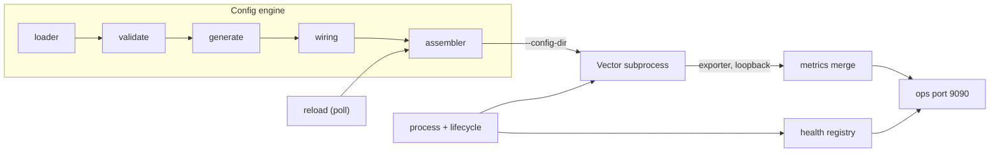

# Architecture

Why this repo exists, what owns what, and the invariants you cannot read off a
single file. For the field-by-field design -- every config key, every generated
block, every state transition -- read [DESIGN.md](DESIGN.md). This document sits
above it.

## The problem

DFE needs a transform stage between its sources and its loader. Vector.dev
already does the per-record transform work well, so building another transform
engine was never the question. The question was the other half.

Vector on its own is opaque to the platform around it. It has its own config
shape, its own metrics endpoint, its own process lifecycle and its own idea of
what "started" means. Every other DFE app presents one control surface: a
big-dial YAML in the config registry, one ops port carrying `/livez`, `/readyz`
and `/metrics`, an OTLP push, a consumer-lag scaling signal and a Helm chart
compiled by dfe-engine. Adopting Vector as it ships would mean dfe-engine,
GitOps and the observability stack each learning a special case.

So Vector is kept, and wrapped. The Rust supervisor is PID 1 and Vector is its
child. The supervisor supplies the production half -- config, credentials,
health, metrics, restarts -- and Vector does the transform. From dfe-engine's
side this app is indistinguishable from dfe-loader or dfe-receiver.

## Why a subprocess

Vector is not designed as a library and has no stable public API for embedding,
so the image downloads the upstream release binary at a pinned version and the
supervisor spawns it with `--config-dir`. The subprocess-versus-compiled-crate
comparison that settled this is in [../RESEARCH.md](../RESEARCH.md), and the
deciding factor was upgrades: a subprocess swaps the binary, a crate rebuilds
against every new Vector version.

That choice has one visible consequence. This is the only DFE Rust app whose
runtime image carries two binaries -- its own, which scalo's deployment contract
builds, and `vector`, which has no slot in that contract. The Dockerfile is
therefore generated by scalo and then spliced: `src/deployment.rs::emit_dockerfile()`
appends `src/vector-layer.dockerfile` with the version substituted in. The other
five DFE Rust apps are single-binary images and need no such override. When
hyperi-ci grows an overlay framework the override moves into `.hyperi-ci.yaml`.

The fragment is a real Dockerfile rather than a Rust string literal so hadolint
and shellcheck can read it. Shell embedded in `format!` is validated by nothing
until the image build runs.

## Who owns what

The boundary is the thing to get right, because most confusion here is a
question asked of the wrong layer.

| Layer | Owns |
|---|---|
| Vector (the child) | Per-record transform work, the Kafka client on the `bus` transport, its own internal metrics |
| This supervisor | Config assembly, process lifecycle and crash recovery, health reporting, the metrics merge, the direct-transport bridge, the deployment artefacts |
| dfe-engine | What the app IS -- it reads `dfe-infra/apps.yaml`, compiles the Helm values and holds the config in its registry |
| dfe-infra | The image pin and the GitOps deployment |

Nothing about this app's shape is coded into dfe-engine. It is a `per_config`
app with `scale_deployed: true`, declared in `dfe-infra/apps.yaml` -- one
deployment per source config, not a singleton, and KEDA drives the replica
count. Its `default_in` list is empty, so it is not part of the default deploy
composition and arrives only when a deployment asks for it.

## The pieces

The config engine turns a handful of big dials into a Vector config directory:
a numbered source file, the user's transform files, a sink file and an
observability file. The user authors only the `transforms:` block. `wiring`
parses the component labels and `inputs` references in those files and joins
`dfe_source` to `dfe_sink` through them, so a transform author does not hand-wire
the topology.

The process manager spawns Vector, forwards signals, and restarts it with
exponential backoff between one and sixty seconds.

The bridge exists on the `direct` transport only. With no broker in the path the
two protocols do not meet: the rest of DFE speaks scalo's `Transport/Push` and
Vector speaks `vector.Vector/PushEvents`. The supervisor translates in both
directions, and both inner legs stay on loopback inside the one pod. On `bus`
the bridge does nothing and Vector talks to Kafka itself.

## Runtime invariants

These are the facts that cost someone a debugging session. None of them is
visible from reading one file.

**Reload polls, and must.** The watcher polls rather than using inotify because
S3-backed mounts -- s3fs, goofys, Mountpoint for S3 -- generate no filesystem
notification events. Swapping in inotify would work on every developer laptop
and silently stop reloading in production.

**Only transforms hot-reload.** A transform change is validated and then
SIGHUPed into Vector. Everything else needs a pod restart, and not by policy:
the consumer and the Push listener are established at startup, the bridge legs
bind at startup, the consumer group id and metrics labels are set at startup,
and the ops listener is bound at startup. A change that classifies as
transforms-only when it is not logs a successful reload for work it never did.

**A push on the direct path is answered only once the next hop has it.** Both
bridge listeners are built armed, so a push is held until the pipeline releases
its records. A hop that refuses is retried until the hold runs out, and then the
push is answered `Unavailable` and its sender retries. The holds nest so an
inner hop is answered while the one around it can still answer its own sender:
18 s at the intake, 16.5 s on the leg back from Vector, and 15 s for each send
to the next stage. A record over the next stage's message-size ceiling is the
one exception: no retry would get it through, so it is released dropped and
counted rather than resent forever.

**Only the intake sheds under pressure.** The leg back from Vector drains
everything the intake holds, so shedding it would stall the stage until the
holds expired into duplicates. Both listeners lease held bytes on the runtime's
memory guard.

**A failed bridge leg stops the process.** Its senders would otherwise retry for
ever against a pod that stayed up, so the service shuts down and exits non-zero.

## Health and metrics invariants

**Port 9598 is a loopback debug surface, not a scrape target.** Vector's own
`prometheus_exporter` binds it. The supervisor GETs it on scalo's metrics
interval and registers every sample on the registry scalo already serves and
pushes over OTLP, so one endpoint carries both. No second Prometheus target and
no PodMonitor selector are involved. The merge is also what makes the app's own
throughput counters non-zero, since Vector owns the Kafka client and the
supervisor never sees a record on the bus transport.

**`/readyz` proves the subprocess exists, not that it carries traffic.** The gate
is that the child was still alive 500ms after spawn, which catches bad argv, an
unreadable config and a pod in crash-recovery backoff. Vector's own startup
routinely takes longer than that, so there is a window where the pod reports
ready and Vector is still coming up. Proving traffic would mean reading Vector's
API, which the supervisor does not do.

## Build, chart and licence invariants

**The Vector version lives in three places and they must agree.** The constant
`VECTOR_VERSION` in `src/deployment.rs` is the source of truth. It is substituted
into the Dockerfile's `ARG VECTOR_VERSION`, and `chart/values.yaml` carries
`config.vector.version` separately. `version_check: strict` refuses to start a
pod when the config's version and the binary's disagree, so a drifted pair is an
outage rather than a warning. A test in `tests/integration/deployment.rs`
compares the committed chart value against the constant, because that pairing
once sat nine minor versions apart and only `version_check: warn` kept pods up.

**`password` is a `String` on purpose, not a `SensitiveString`.** The config
goes through a figment serialize-merge-deserialize round trip in
`apply_figment_env()`, and `SensitiveString` serialises as `***REDACTED***`,
which destroys the value in transit. The protection is elsewhere: the env var is
masked in logs, `Debug` redacts the field, and no credential is written into the
Vector config. The generated components name it `SECRET[<backend>.<key>]` and
Vector's `directory` secret backend reads it from files: the mounted secret at
`sasl.secret_dir`, or owner-only files the assembler writes under
`<config_dir>/.secrets` from a credential given as text. Changing the type to
look safer breaks authentication.

**Vector expands no `${VAR}`.** Since 0.57 interpolation needs
`--dangerously-allow-env-var-interpolation`, which the supervisor never passes,
so a `${...}` in the config reaches Vector as literal text. `validate()` refuses
one in a SASL credential, and `vector validate` does not resolve `SECRET[...]`
either: a missing secret file fails only when Vector starts, which is why the
assembler checks `secret_dir` itself.

**Vector is redistributed unmodified under MPL-2.0.** That carries two
obligations -- ship the licence text and tell recipients where the source is.
Both are discharged inside the image from the release archive's own `LICENSE`,
`NOTICE` and `licenses` tree, so the attribution always matches the exact binary
shipped. Do not replace that with a separate download.

**The committed chart is not pure generator output.** `chart/` carries KEDA
hand-edits the generator does not produce, notably a ScaledObject addressed at
`config.source.*` where the generator emits `config.kafka.*`. A test asserts the
committed chart matches the generator except for four files that are exempted
and asserted to keep diverging, so the exemption cannot go stale unnoticed. A
correction landing in scalo's generator does not reach the ScaledObject by
itself and is carried across by hand.

## Where the transports differ

One deployment runs one transport and the transform you author is identical on
both. What changes is who hands the record over: on `bus` it is a Kafka topic at
each end and Vector uses its own `kafka` source and sink, on `direct` it is a
scalo Push listener in and a Push client out with Vector on `vector` components
over loopback. `templates/bus.yaml` and `templates/direct.yaml` are the whole
topology for each, runnable as they stand. In a DFE deployment the supervisor
generates the `sources:` and `sinks:` blocks, so a whole template mounted as a
transform file gives Vector two sources and two sinks.
